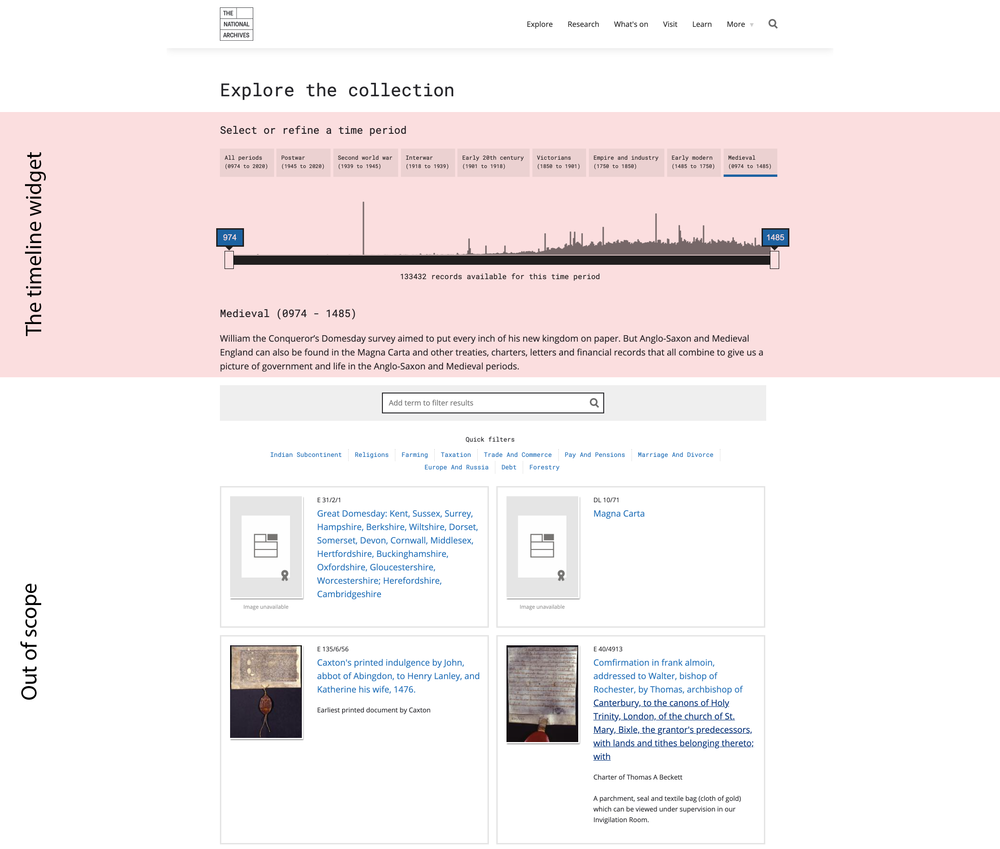
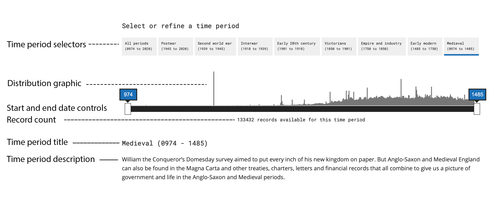

## Contents

* **Alpha prototype**
   * [Background](#background)
   * [Interactions in the Alpha prototype](#interactions-in-the-current-prototype)
     * [Select a time period](#select-a-time-period)
     * [Change start and end date](#change-start-and-end-date)
   * [Known issues](#known-issues)
     * [Accessibility issues](#accessibility-issues)
     * [Usability and other issues](#usability-and-other-issues)
   * [Questions that we have](#questions-that-we-have)
   * [Initial thoughts](#initial-thoughts)
* **Next iteration**
  * [Proposals](#proposals)
  

# Time explorer

This repository is a place to capture information relating to:
 
1. the 'timeline' widget feature developed during Alpha
2. how we plan to improve it in Beta

**Please note:** this is focussed only on the widget and, where relevant, how it relates to other pages. It does not cover other aspects of the explorer prototype (such as pre-defined quick filters, the "Add a term to filter results" input or the results display)

## Background

The purpose of the widget is to facilitate exploration of the collection using the dimension of time. A prototype developed during Alpha from [a workshop sketch](
https://raw.githubusercontent.com/nationalarchives/ds-alpha/master/ux/ideation/sketching-session-1/IMG_20200121_150131.jpg?token=AD2CJS4H6MLXNVSXSG4OX2C7VUGP2) can be found in the [explorer prototype](https://alpha.nationalarchives.gov.uk/collectionexplorer/?start_year=0974&end_year=1485&era=medieval). 

As can be seen below, the current widget has six discrete elements: 

* **Time period selectors** presented in (mostly) left-to-right _reverse chronological_ order
* A **record distribution graphic** presented in left-to-right _chronological_ order
* **Start and end date selectors** which serve as controls and indicators of the current selection
* **Record count**
* Time period **title**
* Time period **description**

## Interactions in the current prototype

As can be seen below, there are two interactions available to users: 

* Select a time period
* Change start or end date within currently selected period

Depending on the interaction there are subtle differences to the way the page is updated. 

### Select a time period

By default the time period shown is 'All periods'. The user can then, optionally, select from a list of a pre-defined time periods. These include:
* **All periods** (this is the default)
* A list (presented left-to-right in _reverse chronological_ order) as:
    * **Postwar** (75+ years covering 2.8 million records)
    * **Second World War** (6 years covering 1 million records)
    * **Interwar** (21 years covering 1.3 million records)
    * **Early 20th century** (17 years covering 1.1 million records)
    * **Victorians** (51 years covering 0.8 million records)
    * **Empire and Industry** (100 years covering 0.5 million records)
    * **Early modern** (265 years covering 1.1 million records)
    * **Medieval** (511 years covering 0.1 million records)

It is currently also possible to reach the widget from a details page with the start and end dates and record distribution graphic set by the corresponding record. In this case there is no time period selected and 'Custom date range' is presented.

### Change start and end date

Changing the start or end date updates the number of records shown and greys out bars within the record distribution graphic outside of the new selection.

There is no functional connection from the date controls to the time periods. For example, if a user was to use the date controls to refine to, say, the years which correspond to the Interwar period, the time periods element would not be updated to reflect this. Similarly, while it is possible to access the explorer page with date periods applied these are not reflected in the time periods. For an example of this, click the 'dated' link in [this record](https://alpha.nationalarchives.gov.uk/journey/record/E/40/4913)
        
## Known issues

The current implementation has significant accessibility problems and usability issues.  

### Accessibility issues

There are several known accessibility issues. In no particular order, these are:

* The **distribution graphic has no text equivalent** to communicate the information to users who are unable to perceive the graphic
* The current approach requires **very fine adjustments** that is likely to cause significant issues for users with motor impairments and those using crude input devices (such as touch screens)
* Displaying distributions from 0 to the millions within a maximum height of 130 often results in **bars that are very difficult to see**. 
* **Controls overlap and obscure** each other rendering the information **invisible** and the controls **unreachable**. 
* The start and end date refinements **do not provide adequate keyboard accessibility** (in that they can require keyboard to make hundreds of changes)

**Note: these are just the immediately apparent accessibility problems. An audit would almost certainly reveal others.** 

### Usability and other issues

* The current approach presents **issues for touch device** users, especially on smaller screens
* Users found the **controls difficult to use** when refining to a narrow period of interest
* Users found the **distribution graphic to be 'bunched up'** when applied to longer periods
* Users were not always clear that **the four digit numbers are years**
* Users have described the record distribution graphic as **'gimmicky'**
* It is not always clear if/how elements of a page change in response to user actions (For example, it is very easy to miss that the results themselves or the record count has changed)
* Users had difficulty understanding that the **date controls and time periods work independently** of each other
* UX colleagues have **recommended marking key events on the timeline** but known issues about the current implementation show this would introduce additional usability and accessibility issues (if applied to _the current approach_)
* The histogram presentation has led users to **believe they can click on the individual bars**. This is not currently possible and would present additional usability and accessibility issues if it was.
* The are circumstances where the controls do not match the record distribution graphic which may lead to confusion 
* There are circumstances where if the explorer is linked to with a date boundary, but no era specified, the histogram will display as all periods, but the slider will display a strict date boundary. Therefore the histogram is not properly zoomed to the specific date boundaries.  

## Questions that we have 

* Does the distribution graph help a non-user understand what they are looking at and where to go next? Where does the distribution graph sit in the content priority?
* Does it matter that the dating of records can lead to confusing results? For example, records relating to The United States appear where a filter has been applied from 1075 to 1094. See [this example](https://alpha.nationalarchives.gov.uk/collectionexplorer/?start_year=1075&end_year=1094&era=medieval)
* What is a key event and how do these relate to time periods? Is WWII both a key event and a time period?
* Do we still need to keep all items available when a user has made a selection? For example, if a user has refined to late 20th century, do they still need to see the Medieval time period?
* Is there a point at which the record distribution graph is no longer useful to user? 
* Do people want to interact with the content using different filters at different levels? For example, do people need to apply a subject filter when at 'All periods'?  

## Initial thoughts

* Should we represent the ability to browse by time on details pages?
* Is it more helpful to show users (on the details page) where they are in time (i.e. Early modern)?
* Should we have different visualisations/treatments to suit the scale of content (i.e. all periods vs Second World War)
* The cause and effect of things is not very clear. For example, upon entering via 'All periods' you are shown a dense histogram and this can change to large blocks. 
* Search and browse are very different things and we feel it is confusing for users to show functionality which looks like search on something that is not a search tool.

## Other options to consider

[Historpedia.js](https://js.histropedia.com/index.html) has been mentioned as an approach that might be worth considering. This is a JavaScript-powered visualisation tool.

# Proposals

The _current_ proposals for a next iteration are: 

* Ash's (link coming soon)
* Matt's (link coming soon)
* [Gwyn's](gwyn_proposal_iteration_two)
